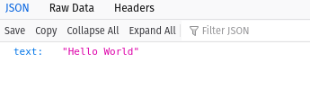
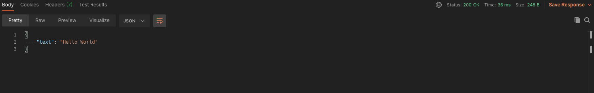
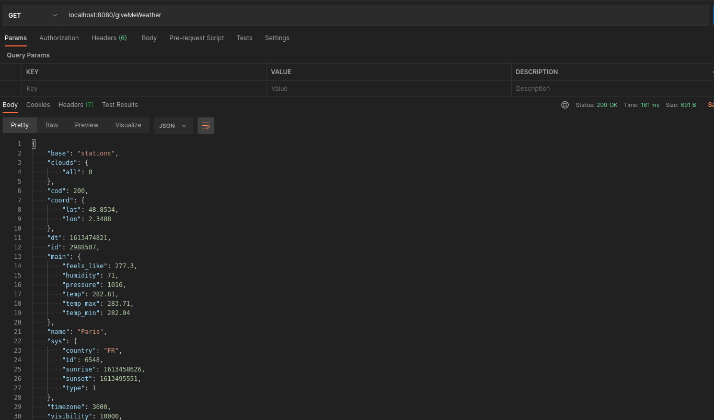

# EPITECH_WorkShop_MicroService
In this workshop you will learn how to use a REST API through TypeScript, Express, Docker and Postman.
You will also be introduced to the use of an API Gateway (in this case, we choose an open source project called KrakenD) which is the basis of a microservice architecture

# Step 1 : Downloads

Download the package manager NPM : https://www.npmjs.com/get-npm
Download Docker : https://docs.docker.com/get-docker/
Download Postman : https://www.postman.com/downloads/

# Step 2 : Comprehension

- Open the package.json and try to understand what is this file
- Open the app.ts and try to understand what is this file (tips: main)

# Step 3 : Start the TypeScript API

  # Step 3.1 : Install all dependencies 

  - Go on the root of the API_ts file and execute this command : npm install

  # Step 3.1 : Start the TypeScript REST API

  Stay on the root of the API_ts and execute this command : npm start
    - What is doing this command : 
      This command will execute the script section of the package.json file and launch the program
    
# Step 4 : First Request

- Open the /src/routes/routes.ts file
What do you see ?
What is the http verb GET ?
What is a Controller ?

- Open the /src/controller/user.controller.ts file
There it is !! The first Exercice !!
Goal of this exercice : Return the result of a front request like : localhost:8002/helloworld
the result of the request must be like :
{
  text: "Hello World"
}

If you have done this exercise well, logically when you go to a web page and type: localhost: 8002/helloworld, you are supposed to have this as a result:

# Step 4 : First Request on Postman

Postman is your best friend in web developement !!

try to request the precedent exercice via Postman

you are supposed to have this as a result :

# Step 5 : Docker

# Step 6 : API GateWay

All the documentation is here : https://www.krakend.io/docs/overview/introduction/

open the ./KrakenD/krakend.json file and setup your first redirection!

at the link now to ping the localhost: 8002, if you did your job well, you are supposed to ping and have the same result as before on the localhost: 8080

# Step 7 : go further

Now that you know how to use all the tools, we offer you a more complicated exercise.

You are now going to go ping an outside API, we have chosen a weather API.
The goal is simple: retrieve all the information related to the weather in relation to a given city !

Go to the ./API_ts/src/controller/user.controller.ts file.
perform the exercise

you are supposed to have this as a result :

